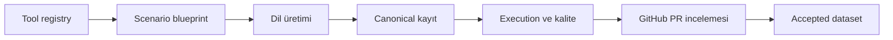

# magibu-toolcall

`magibu-toolcall`, Türkçe tool-calling eğitim verisini tasarlamak, üretmek,
doğrulamak ve insan incelemesine hazırlamak için geliştirilen kalite odaklı bir
Python altyapısıdır.

Proje yalnızca modelden örnek istemez. Tool sözleşmesini, scenario planını,
execution sonucunu, provenance bilgisini ve kalite kanıtını aynı izlenebilir
akışta birleştirir. Amaç; doğal Türkiye Türkçesi kullanan, doğru tool'u doğru
argümanlarla çağıran ve cevabını gerçek tool sonucuna dayandıran eğitim kayıtları
oluşturmaktır.

> **Proje durumu:** Altyapı çalışır durumdadır. Depoda şu anda etkin aday tool
> kataloğu, üretim blueprint'i, kabul edilmiş dataset kaydı veya onaylı canlı API
> tool'u yoktur. `registry/registry.jsonl` içindeki üç `demo` tool yalnız altyapı
> testleri içindir.

> **Geçici pilot dalı:** `pilot/small-e2e-20260810`, akışı gerçek provider'larla
> doğrulamak için iki `candidate` tool, beş üretim blueprint'i ve beş kayıtlık
> review paketi içerir. Bu dal `main`e merge edilmek için hazırlanmamıştır.

## Temel yetenekler

- JSON Schema tabanlı registry, blueprint, dataset ve benchmark sözleşmeleri
- DeepSeek Flash-first, Pro-fallback doğal dil üretimi
- Deterministik local, fixture-backed mock ve resetlenebilir simülasyon execution'ı
- OpenAI tabanlı semantic duplicate ve yapılandırılmış kalite değerlendirmesi
- Token bütçesi, retry, sınırlı paralellik, checkpoint ve hata kuyruğu
- Canonical audit kaydı ile metadata'sız training projection ayrımı
- GitHub PR tabanlı insan incelemesi ve katkı rehberi botu

Model yalnız kullanıcı ve asistan doğal dilini üretir. Function tanımları,
argümanlar, call ID'leri, tool sonuçları, provenance ve kalite durumları kod
tarafından oluşturulur veya doğrulanır. Provider çıktısı tek başına bir kaydı
`accepted` yapamaz.

## Aktif kapsam

| Kaynak türü | Amaç | Durum |
| --- | --- | --- |
| `original_turkish` | Genel amaçlı tool'lar için doğrudan Türkçe senaryolar | Altyapı hazır; katalog oluşturulacak |
| `turkey_native` | Türkiye'deki kurum, açık veri ve yerel hizmet senaryoları | Altyapı hazır; kaynaklar onaylanacak |
| `translated` | xLAM, When2Call ve benzeri kaynakların lokalizasyonu | Askıda |

Dataset ve benchmark birbirinden ayrı yaşam döngüleridir. Benchmark doğrulama ve
değerlendirme altyapısı mevcuttur; benchmark aday üretimi şimdilik askıdadır.

## Akış



Her aşama bir sonrakine doğrulanmış kanıt bırakır. Ayrıntılı güven sınırları ve
modüller [mimari belgesinde](docs/architecture.md), uygulanabilir komutlar ise
[teknik kullanım rehberinde](README_TEKNIK.md) açıklanır.

## Güncel depo durumu

| Varlık | Mevcut durum |
| --- | --- |
| Canonical registry | 3 adet `demo` tool |
| Proposal registry | `main`: yok; bu geçici pilot dalında 2 `candidate` tool |
| Üretim blueprint'i | `main`: yok; bu geçici pilot dalında 5 blueprint |
| Accepted dataset | Henüz yok |
| Onaylı canlı API tool'u | Henüz yok |

`candidate`, kaynak, lisans veya canlı API onayı anlamına gelmez. Her tool kendi
kaynak ve execution kanıtıyla ayrıca incelenir.

## Hızlı başlangıç

Python 3.11 veya daha yeni bir sürüm gerekir.

```powershell
python -m venv .venv
.\.venv\Scripts\python.exe -m pip install -e ".[dev]"
.\.venv\Scripts\python.exe -m pytest
```

API anahtarı gerektirmeyen ilk kontrol:

```powershell
.\.venv\Scripts\magibu-toolcall.exe registry validate registry\registry.jsonl
.\.venv\Scripts\magibu-toolcall.exe blueprint validate tests\fixtures\blueprints\valid\single_tool.json --registry registry\registry.jsonl
.\.venv\Scripts\magibu-toolcall.exe tool run-fixture utility.add.basic
```

Kurulumdan tek kayıt üretimine ve kalite kontrolüne kadar bütün komutlar
[teknik kullanım rehberinde](README_TEKNIK.md) yer alır.

## Bilinçli sınırlar

Proje şu anda:

- aday tool'ları otomatik olarak onaylamaz;
- belgelenmemiş servisleri scrape etmez;
- ödeme, e-posta veya başka yan etkili canlı işlem çalıştırmaz;
- gerçek kişi verisini fixture ya da dataset içine kabul etmez;
- model değerlendirmesini insan onayı yerine koymaz;
- lisans kararı verilmeden kodu veya dataset'i yayımlanabilir saymaz.

Tam liste için [bilinen sınırlamalara](docs/known_limitations.md) bakın.

## Dokümantasyon

| Başlangıç noktası | İçerik |
| --- | --- |
| [Dokümantasyon merkezi](docs/README.md) | Rehberler, kavramlar, referanslar ve proje durumu |
| [Teknik kullanım rehberi](README_TEKNIK.md) | Kurulum, CLI, tek kayıt testi ve toplu üretim |
| [Katkı rehberi](CONTRIBUTING.md) | Tool, blueprint, dataset ve dokümantasyon katkısı |
| [Veri alanları](data/README.md) | Dataset ile benchmark yaşam döngülerinin ayrımı |

Makine tarafından doğrulanan sözleşmeler için Markdown belgeleri değil,
`schemas/` altındaki JSON Schema dosyaları kaynak kabul edilir. CLI davranışında
ise güncel `magibu-toolcall --help` çıktısı son sözdür.

## Lisans

Kod ve dataset için yayın lisansı henüz seçilmemiştir. Lisans ve kaynak yeniden
dağıtım kararları tamamlanmadan public release yapılmamalıdır.
