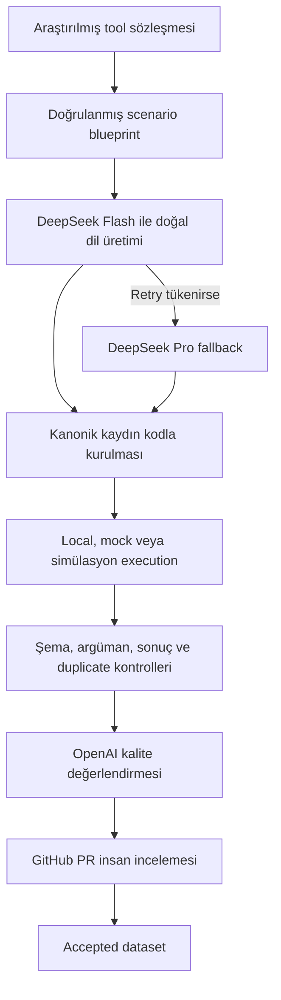

# magibu-toolcall

`magibu-toolcall`, Türkçe tool-calling eğitim verisini scenario tasarımından
insan onayına kadar izlenebilir ve tekrar üretilebilir biçimde yöneten bir Python
projesidir.

Sistem; modelin ne zaman tool kullanması gerektiğini, doğru function’ı seçmesini,
geçerli argüman üretmesini ve tool sonucunu doğal Türkiye Türkçesiyle aktarmasını
öğretecek kayıtlar hazırlamaya odaklanır. Model çıktısı tek başına kabul edilmez;
registry, execution, doğrulama, kalite kanıtı ve GitHub incelemesi birlikte
değerlendirilir.

> **Güncel durum:** Kod, CLI, testler ve 30 pilot blueprint çalışır durumdadır.
> Repository henüz yayımlanmış 1.000 kayıtlık bir dataset veya kabul edilmiş
> canlı API kataloğu içermez.

Kurulum ve komutlar için [teknik kullanım rehberine](README_TEKNIK.md), katkı
hazırlamak için [katkı rehberine](CONTRIBUTING.md) bakın.

## Kapsam

Aktif dataset çalışması iki kaynak türünü kapsar:

| Kaynak türü | Amaç | Durum |
| --- | --- | --- |
| `original_turkish` | Genel amaçlı tool’lar için doğrudan Türkçe senaryolar | Aktif |
| `turkey_native` | Türkiye’deki kurum, açık veri ve yerel hizmet senaryoları | Aktif |
| `translated` | xLAM, When2Call ve benzeri kaynakların lokalizasyonu | Askıda |

Benchmark kodu ve klasörleri dataset’ten ayrıdır. Benchmark üretimi güncel
dataset akışının parçası değildir ve dataset kayıtları benchmark gold alanına
taşınmaz.

## Sistem nasıl çalışır?



DeepSeek yalnız doğal dil üretiminde kullanılır. Function tanımları, call ID’leri,
argümanlar, execution sonuçları, provenance ve kalite durumları kod tarafından
kurulur veya doğrulanır. Model iç operasyon metadata’sını görmez; eğitim exportu
da canonical audit kaydından ayrı üretilir.

## Hazır olan yetenekler

- JSON Schema tabanlı registry, blueprint, dataset ve benchmark doğrulaması
- Genel Türkçe ve Türkiye-native scenario üretimi
- DeepSeek Flash-first, Pro-fallback üretim politikası
- Token bütçesi, sınırlı paralellik, retry, checkpoint ve hata kuyruğu
- Deterministik local tool, sabit fixture ve resetlenebilir simülasyon execution’ı
- Onaylı sözleşmeler için salt-okunur HTTPS GET JSON adaptörü
- Exact, normalize ve OpenAI embedding tabanlı semantic duplicate kontrolü
- OpenAI birincil kalite hakemi ve yapılandırılabilir escalation hakemi
- Çince/Han karakteri, `<think>`, iç operasyon etiketi ve biçim sızıntısı kontrolleri
- GitHub PR üzerinden insan incelemesi ve hafif katkı rehberi botu
- Canonical audit kaydı ve metadata’sız training projection exportu

## Mevcut içerik

| Varlık | Mevcut durum |
| --- | --- |
| Canonical registry | 3 adet `demo` tool |
| Proposal registry | 20 adet `candidate` tool |
| Pilot blueprint | 30 adet: 15 genel Türkçe, 15 Türkiye-native |
| Regresyon blueprint | 1 adet |
| Proposal execution dağılımı | 4 local, 14 mock, 2 fully simulated |
| Accepted dataset | Henüz yok |

`candidate`, canlı API onayı anlamına gelmez. Kaynak erişimi, kullanım koşulları,
lisans, güncellik ve execution implementasyonu bağımsız olarak doğrulanmadan tool
`approved` sayılmaz.

## Kalite kapıları

Bir kaydın accepted olabilmesi için:

1. Dataset ve tool şemaları geçerli olmalı.
2. Tool seçimi, argümanlar, çağrı sırası ve sonuç eşleşmeli.
3. Tanımlanan execution gerçekten çalışmalı ve sonucu output schema’ya uymalı.
4. Duplicate ve provenance kontrolleri tamamlanmalı.
5. Otomatik Türkçe/grounding değerlendirmesi geçmeli.
6. GitHub PR üzerinde bağımsız insan incelemesi tamamlanmalı.

Provider’ın `passed` veya `accepted` demesi bu kapılardan hiçbirini atlayamaz.
PR botu açıklama bölümlerini ve test/kalite raporu gibi temel katkı eşleşmelerini
kontrol eder. Registry, fixture, blueprint, dataset ve test doğrulamaları ayrı
`validate` workflow’unda çalışır. Bot insan onayı vermez.

## Execution türleri

| Tür | Kullanım |
| --- | --- |
| `local_executable` | Ağsız, deterministik hesaplama veya sürümlü yerel lookup |
| `mock` | Şema uyumlu, dondurulmuş gerçek kaynak ya da sentetik fixture |
| `fully_simulated` | Dış sisteme dokunmayan, resetlenebilir durum değişimi |
| `real_api` | Açıkça onaylanmış salt-okunur canlı kaynak |
| `sandbox` | Sözleşmede var; çalışır adapter henüz yok |
| `not_applicable` | Tool çağrısı gerekmeyen senaryo |

`mock` kelimesi veri kökenini tek başına açıklamaz. Resmî/API snapshot’ı izinli
biçimde normalize edilip kaynak, tarih, sürüm ve checksum ile dondurulabilir;
tamamen sentetik fixture da kullanılabilir. Köken provenance’da açıkça belirtilir.
Execution modu sessizce değiştirilmez.

## Bilinçli sınırlar

Proje şu anda:

- proposal tool’ları kendiliğinden canlı veya onaylı saymaz;
- belgelenmemiş servisleri scrape etmez ve kullanım koşullarını kullanıcı adına
  kabul etmez;
- POST, ödeme, e-posta veya başka yan etkili canlı işlem çalıştırmaz;
- gerçek kişi verisini fixture ya da dataset içine kabul etmez;
- model değerlendirmesini insan onayı yerine koymaz;
- askıdaki çeviri veya benchmark üretimini dataset akışına karıştırmaz;
- seçilmemiş kod/dataset lisansıyla açık kaynak yayını yapmaz.

Güncel açık noktalar [sınırlamalar belgesinde](docs/known_limitations.md) tutulur.

## Hızlı başlangıç

Python 3.11 veya daha yeni bir sürüm gerekir.

```powershell
python -m venv .venv
.\.venv\Scripts\python.exe -m pip install -e ".[dev]"
.\.venv\Scripts\python.exe -m pytest
```

API gerektirmeyen ilk kontroller:

```powershell
.\.venv\Scripts\magibu-toolcall.exe registry validate registry\proposals\pilot_candidates.jsonl
.\.venv\Scripts\magibu-toolcall.exe blueprint validate blueprints\pilot_general.jsonl --registry registry\proposals\pilot_candidates.jsonl
.\.venv\Scripts\magibu-toolcall.exe tool run-fixture calculator.evaluate.basic --registry registry\proposals\pilot_candidates.jsonl
```

Canlı provider kullanımı için `.env.example` dosyasını `.env` olarak kopyalayın,
yalnız kendi anahtarlarınızı girin ve `.env` dosyasını commit etmeyin. Ayrıntılı
tek-kayıt ve toplu akış [teknik rehberde](README_TEKNIK.md) yer alır.

## Katkı akışı

Tool sözleşmesi, execution kodu, blueprint ve test aynı PR’da birlikte
incelenebilir. Dataset adayı varsa eşleşen kalite raporu da PR’a eklenir.
Reviewer kimliği ve karar geçmişi GitHub’da tutulur; CLI reviewer girişi istemez.

Başlangıç noktası: **[CONTRIBUTING.md](CONTRIBUTING.md)**

## Proje yapısı

```text
blueprints/              Scenario planları ve regresyon kayıtları
configs/                 Çalışma ayarları
data/dataset/            Dataset yaşam döngüsü
data/benchmark/          Ayrı ve askıdaki benchmark yaşam döngüsü
registry/                Canonical registry ve fixture’lar
registry/proposals/      Candidate tool sözleşmeleri ve fixture’ları
review/                  Commit edilebilir kalite kanıtları
runs/                    Yerel manifest, checkpoint ve çalışma çıktıları
schemas/                 Makine tarafından doğrulanan sözleşmeler
src/tool_call_tr/        Uygulama ve CLI kodu
tests/                   Deterministik test paketi
```

## Belgeler

- [Teknik kullanım rehberi](README_TEKNIK.md)
- [Katkı rehberi](CONTRIBUTING.md)
- [Tool seçimi ve kaynak sınırları](docs/pilot_tool_selection.md)
- [Scenario blueprint kuralları](docs/scenario_blueprints.md)
- [Execution ortamları](docs/execution_environments.md)
- [Dataset yaşam döngüsü](data/dataset/README.md)
- [Kalite ve PR inceleme alanı](review/README.md)

<!-- contribution-guidance-smoke-test -->
