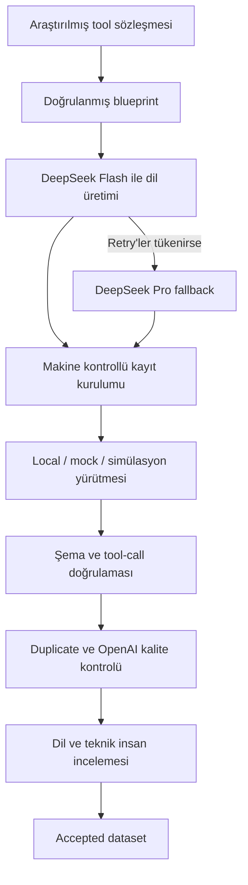

# magibu-toolcall

Türkçe tool-calling verisini tasarımdan insan onayına kadar yöneten,
kalite-odaklı dataset üretim altyapısı.

`magibu-toolcall`; bir dil modelinin ne zaman araç kullanması gerektiğini
anlaması, doğru aracı seçmesi, geçerli argüman üretmesi ve araç sonucunu doğal
Türkiye Türkçesiyle aktarması için eğitim verisi hazırlamaya yardımcı olur.
Yalnızca metin üretmez: her aday kaydı doğrulanabilir bir üretim, yürütme ve
inceleme zincirinden geçirir.

> **Proje durumu:** Altyapı pilotu çalışıyor ve testlerle doğrulanıyor. Bu depo
> henüz yayımlanmış 1000 kayıtlık bir dataset veya dondurulmuş benchmark değildir.

Kurulum, ortam değişkenleri ve bütün CLI komutları için
**[teknik kullanım rehberine](README_TEKNIK.md)** geçin.

## Neden bu proje var?

Tool-calling dataseti hazırlamak yalnızca doğru biçimde JSON üretmek değildir.
Kaliteli bir kaydın aynı anda şu sorulara cevap verebilmesi gerekir:

- Kullanıcının isteği doğal ve yerel Türkçeyle mi yazılmış?
- Gerçekten bir araç gerekiyor mu ve seçilen araç doğru mu?
- Argümanlar yalnızca kullanıcı mesajından mı geliyor?
- Son yanıt, araç sonucunu eksiksiz ve uydurmadan mı aktarıyor?
- Kaydın kaynağı, dönüşüm geçmişi ve üretici modeli izlenebiliyor mu?
- Aynı veya çok benzer bir kayıt daha önce üretildi mi?
- Otomatik kontrollerin ardından insan incelemesi yapıldı mı?

`magibu-toolcall` bu soruları bağımsız kalite kapılarına dönüştürür. Bir modelin
“başarılı” demesi, kaydın kabul edilmesi için hiçbir zaman yeterli değildir.

## Kapsam ve güncel odak

Üç veri kaynağı aynı dataset sözleşmesi altında yönetilir:

| Kaynak türü | Açıklama | Durum |
| --- | --- | --- |
| `original_turkish` | Genel araçlar için doğrudan Türkçe hazırlanan senaryolar | Aktif |
| `turkey_native` | Türkiye kurumları, açık verileri ve yerel hizmetleriyle ilgili senaryolar | Aktif |
| `translated` | xLAM, When2Call ve benzeri kaynakların Türkçeleştirilmesi | Askıda |

Benchmark altyapısı kodda korunur ancak dataset’ten fiziksel ve operasyonel
olarak ayrıdır. Dataset kaydı benchmark gold alanına kopyalanmaz; benchmark
üretimi güncel çalışma planında askıdadır.

## Kalite-odaklı çalışma akışı



DeepSeek yalnızca doğal dil alanlarını üretir. Tool tanımı, çağrı kimliği,
argüman, sonuç, metadata ve kalite durumu kod tarafından kurulur veya
doğrulanır. Böylece model üretimi ile kanonik kayıt yapısı birbirinden ayrılır.

## Bugün hazır olan altyapı

### Üretim

- DeepSeek V4 Flash birincil, V4 Pro kontrollü fallback politikası
- Token bütçeli, retry destekli ve sınırlı paralel üretim
- Checkpoint, shard, hata kuyruğu ve kaldığı yerden devam edebilme
- Blueprint ve registry checksum’larını manifestte sabitleme
- Model çıktısındaki güvenilmez kabul veya kalite iddialarını temizleme

### Otomatik kalite

- JSON Schema, tool seçimi, argüman ve sonuç doğrulaması
- OpenAI embedding tabanlı semantic duplicate taraması
- Birincil mini ve gerektiğinde tam modelle kalite değerlendirmesi
- Model anlaşmazlığında kaydı otomatik olarak bloke eden escalation akışı
- Han/Çince karakter, `<think>`, ham ISO zaman ve Markdown sızıntısı korumaları

### Yürütme

- Deterministik yerel fonksiyonlar
- Dondurulmuş veya sentetik mock fixture’lar
- Sıfırlanabilir ve dış sisteme dokunmayan stateful simülasyonlar
- Onaylı araçlar için kontrollü, salt-okunur HTTPS JSON adaptörü
- Timeout, rate-limit, boş sonuç ve geçersiz sonuç durumlarının normalizasyonu

### Yönetişim

- Dataset ve benchmark için ayrı kimlik, klasör ve yaşam döngüleri
- Rol ve izin tabanlı access-policy
- SHA-256 zincirli audit olayları
- Contributor ile reviewer ayrımı
- Otomatik kalite sonrasında zorunlu insan incelemesi

## Doğrulanmış pilot

Mevcut pilot yalnızca bir demo değildir; aynı üretim ve kalite hattının küçük,
ölçülebilir uygulamasıdır.

| Gösterge | Sonuç |
| --- | ---: |
| Proposal tool sayısı | 20 |
| Pilot blueprint sayısı | 30 |
| Genel Türkçe / Türkiye-native dağılımı | 15 / 15 |
| Otomatik test | 189/189 |
| Genel dataset kalite geçişi | 15/15 |
| Türkiye-native kalite geçişi | 14/15 |

7 Ağustos 2026 tarihinde aynı 30 blueprint üzerinde yapılan model
karşılaştırması:

| Model | Üretim | OpenAI kalite geçişi | Ortalama skor |
| --- | ---: | ---: | ---: |
| DeepSeek V4 Flash | 30/30 | 30/30 | 4,9857 |
| DeepSeek V4 Pro | 30/30 | 28/30 | 4,9191 |

Bu sonuçla `Flash-first, Pro fallback` politikası kabul edildi. Dataset
pilotundaki tek başarısız kargo kaydı geçmiş kanıtı olarak değiştirilmeden
korundu; ayrı bir regresyon blueprint’iyle yeniden üretildi ve hem mini hem tam
OpenAI hakeminden geçti.

Bu sonuçlar otomatik kaliteyi gösterir. Pilot kayıtları henüz insan dil ve teknik
incelemesini tamamlamadığı için `accepted` değildir.

## Neler yapabilir?

`magibu-toolcall` bugün:

- Registry, fixture, blueprint, dataset ve benchmark kayıtlarını doğrulayabilir.
- Genel Türkçe ve Türkiye-native dataset adayları üretebilir.
- Tool çağrılarını tanımlanan yürütme modunda gerçekten çalıştırabilir.
- Tool argümanlarını ve sonuçlarını şemaya karşı sınayabilir.
- Exact, normalize ve semantic tekrarları bulabilir.
- OpenAI hakemiyle dil ve tool-grounding kalitesini puanlayabilir.
- İnsan review kararlarını değişmez geçmiş olaylarıyla kaydedebilir.
- Yalnızca bütün kapıları geçen kayıtları accepted dataset’e aktarabilir.
- Model, token, request, checksum ve audit kanıtlarını raporlayabilir.

## Neleri yapamaz veya yapmamalıdır?

Sistemin sınırları bilinçli olarak açıktır:

- Henüz tamamlanmış 1000 kayıtlık bir dataset sunmaz.
- Proposal registry’deki araçları otomatik olarak canlı ve onaylı API saymaz.
- Mock sonucu gerçek kurum verisi veya gerçek zamanlı gözlem gibi göstermez.
- Belgelenmemiş servisleri scrape etmez ya da kullanım koşullarını kullanıcı adına kabul etmez.
- Reviewer kimliği uydurmaz veya model değerlendirmesini insan onayı yerine koymaz.
- Contributor’ın kendi kaydını onaylamasına izin vermez.
- Secret değerlerini fixture, manifest, audit veya hata çıktısına yazmaz.
- Mevcut HTTP adaptörüyle POST, ödeme, e-posta veya başka yan etkili işlem yapmaz.
- Değişken canlı API sonucunu geçmiş dataset kaydının doğrulama temeli yapmaz.
- Askıdaki çeviri ve benchmark hatlarını kendiliğinden çalıştırmaz.

## Mock ve gerçek API ilişkisi

Pilot güvenli yürütme ağırlıklıdır: 20 aracın 14’ü mock, pilot içindeki toplam
30 tool çağrısının 22’si fixture üzerinden çalışır. Bu dağılım altyapıyı sınamak
için uygundur; 1000 kayıtlık üretim için mevcut sentetik çeşitlilik yeterli
değildir.

Gerçek bir API bulunduğunda mock katmanı silinmez. Önerilen veri yolu şöyledir:

```text
Gerçek API veya resmî kaynak
  → erişim ve lisans incelemesi
  → normalizasyon ve kişisel veri temizliği
  → kaynak, zaman, sürüm ve checksum kaydı
  → dondurulmuş fixture
  → deterministik dataset üretimi
```

API’den kaydedilmiş fixture yürütme sırasında mock olabilir; ancak provenance
bilgisi bunun tamamen sentetik olmadığını açıkça gösterir. Bu yaklaşım gerçekçilik
ile tekrar üretilebilirliği birlikte korur.

| Yürütme türü | Kullanım alanı |
| --- | --- |
| `local_executable` | Ağ gerektirmeyen deterministik hesaplama ve yerel veri |
| `mock` | Dondurulmuş gerçek kaynak veya tamamen sentetik fixture |
| `fully_simulated` | Durum değiştiren fakat dış sisteme dokunmayan senaryo |
| `real_api` | Açıkça onaylanmış salt-okunur canlı kaynak |
| `not_applicable` | Tool çağrısı gerekmeyen kayıt |

Yürütme modu sessizce değiştirilmez. Her mod geçişi açık bir neden ve provenance
olayı gerektirir.

## Hızlı başlangıç

Python 3.11 veya daha yeni bir sürüm gereklidir.

```powershell
python -m venv .venv
.\.venv\Scripts\python.exe -m pip install -e ".[dev]"
.\.venv\Scripts\python.exe -m pytest
```

API anahtarları yalnız Git tarafından yok sayılan `.env` dosyasına yazılır:

```powershell
Copy-Item .env.example .env
notepad .env
.\.venv\Scripts\magibu-toolcall.exe config
```

Yerel registry ve blueprint doğrulaması API anahtarı gerektirmez:

```powershell
.\.venv\Scripts\magibu-toolcall.exe registry validate registry\proposals\pilot_candidates.jsonl
.\.venv\Scripts\magibu-toolcall.exe blueprint validate blueprints\pilot_general.jsonl --registry registry\proposals\pilot_candidates.jsonl
```

Canlı model erişimi, dataset üretimi, kalite kontrolü ve insan incelemesi için
gereken bütün komutlar [teknik kullanım rehberinde](README_TEKNIK.md) yer alır.

## Bundan sonra ne var?

Altyapının temel akışı hazırdır. 1000 kayda ölçeklenmeden önce:

1. Uygun gerçek API ve resmî veri kaynakları seçilecek.
2. Erişim, lisans ve yeniden kullanım koşulları doğrulanacak.
3. API yanıtları mevcut tool sözleşmelerine normalize edilecek.
4. Gerçek kaynaklı ve dondurulmuş fixture çeşitliliği artırılacak.
5. Üretim operatöründen farklı dil ve teknik reviewer’lar atanacak.
6. İnsan incelemesi tamamlanan pilotun ardından 100 kayıtlık ikinci kapıya geçilecek.

## Proje yapısı

```text
blueprints/              Üretim planları ve kalite regresyonları
configs/                 Erişim politikaları
data/dataset/            Dataset yaşam döngüsü
data/benchmark/          Dataset’ten ayrı benchmark yaşam döngüsü
registry/                Kanonik tool registry ve fixture’lar
registry/proposals/      Henüz onaylanmamış pilot araçları
review/                  İnsan incelemesi ve audit alanı
runs/                    Manifest, checkpoint ve çalışma kanıtları
schemas/                 Makine tarafından doğrulanan veri sözleşmeleri
src/tool_call_tr/        CLI ve uygulama kodu
tests/                   Deterministik test paketi
```

## Belgeler

- **[Teknik kullanım rehberi](README_TEKNIK.md):** Kurulum, yapılandırma, CLI akışları ve ayrıntılı çalışma kuralları
- [Pilot tool seçim dosyası](docs/pilot_tool_selection.md): Tool adayları, kaynak araştırması, riskler ve onay engelleri
- [Dataset yaşam döngüsü](data/dataset/README.md): Staging, kalite, review ve accepted alanları
- [Benchmark yaşam döngüsü](data/benchmark/README.md): Ayrı benchmark alanı ve freeze kuralları
- [İnceleme alanı](review/README.md): Reviewer kararları ve audit yaklaşımı

Uygulamayı kullanmaya başlamak için:
**[README_TEKNIK.md — teknik kullanım rehberi](README_TEKNIK.md)**
